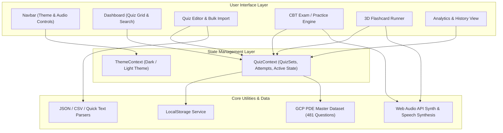

# CBT Quiz App

Offline-first Computer-Based Testing (CBT) and active recall learning web application. Built with React 19, Vite, TypeScript, and Vanilla CSS.

---

## Architecture

The application uses React Context for state management and syncs data to browser `localStorage`. No external backend server is required.



### Directory Structure

```text
cbt-quiz-app/
├── public/
├── src/
│   ├── components/
│   │   ├── analytics/        # Performance statistics and attempt logs
│   │   ├── common/           # Navbar, QuizConfigModal (Session Setup)
│   │   ├── dashboard/        # Quiz set grid, search, and category filters
│   │   ├── flashcard/        # 3D flip card runner and Leitner rating buttons
│   │   ├── quiz-editor/      # Question builder and bulk import modal
│   │   └── quiz-runner/       # Timed CBT exam runner and score results modal
│   ├── context/
│   │   ├── QuizContext.tsx   # Quiz sets CRUD, attempt tracking, and state
│   │   └── ThemeContext.tsx  # Theme state management
│   ├── data/
│   │   ├── defaultQuizzes.ts # Default pre-loaded quiz sets
│   │   └── gcpPdeQuizzes.ts  # Master GCP PDE question bank (481 questions)
│   ├── types/
│   │   └── quiz.ts           # TypeScript interfaces (QuizSet, Question, Attempt)
│   ├── utils/
│   │   ├── confetti.ts       # Canvas confetti score launcher
│   │   ├── exportImport.ts   # JSON, CSV, and formatted text parser
│   │   └── sound.ts          # Web Audio synthesizer and Web Speech TTS
│   ├── App.tsx
│   ├── index.css             # High-clarity design system (Slate theme)
│   └── main.tsx
├── convert_docx_json.py      # Python script to convert .docx to JSON/CSV
├── package.json
└── vite.config.ts
```

---

## Core Features

- **CBT Exam Mode**: Timed exam interface with countdown clock, question palette, question flagging for review, and score reporting.
- **Practice Mode**: Step-by-step practice with instant answer checking, hints, and explanations.
- **3D Flashcards**: Flip card interface with Leitner difficulty ratings (Again, Hard, Good, Easy) and text-to-speech audio reader.
- **Custom Session Setup**: Flexible batch launcher. Practice full question banks or split questions into custom subsets (e.g. 10, 25, 50, 100 questions, or custom ranges).
- **Bulk Import & Export**: Import questions from JSON, CSV, or formatted plain text. Export any quiz set to JSON or CSV for backup.
- **Analytics & History**: Track average scores, pass rates, study days, and generate review tests from previously missed questions.
- **Offline Storage**: All quiz data, attempts, and custom sets persist in browser local storage.

---

## Bulk Import JSON Format

You can import custom quiz sets or questions by uploading a `.json` file in the Bulk Import modal.

### Quiz Set JSON Example

```json
{
  "title": "AWS Solutions Architect Practice",
  "description": "Practice questions for AWS certification.",
  "category": "Cloud Computing",
  "tags": ["AWS", "Cloud"],
  "timeLimitMinutes": 30,
  "questions": [
    {
      "id": "q1",
      "type": "single",
      "prompt": "Which AWS service provides object storage?",
      "options": ["Amazon EC2", "Amazon S3", "Amazon EBS", "Amazon DynamoDB"],
      "correctAnswers": [1],
      "explanation": "Amazon S3 is scalable object storage.",
      "hint": "Simple Storage Service",
      "points": 1
    },
    {
      "id": "q2",
      "type": "multiple",
      "prompt": "Select all database ACID properties:",
      "options": ["Atomicity", "Consistency", "Isolation", "Durability"],
      "correctAnswers": [0, 1, 2, 3],
      "explanation": "ACID stands for Atomicity, Consistency, Isolation, and Durability.",
      "points": 2
    },
    {
      "id": "q3",
      "type": "true-false",
      "prompt": "Containers share the host OS kernel.",
      "options": ["True", "False"],
      "correctAnswers": ["true"],
      "explanation": "Docker containers leverage host kernel isolation.",
      "points": 1
    },
    {
      "id": "q4",
      "type": "fill-blank",
      "prompt": "What keyword declares a read-only variable in JavaScript?",
      "correctAnswers": ["const"],
      "explanation": "const creates a block-scoped constant.",
      "points": 1
    }
  ]
}
```

### Question Types Field Reference

- `single`: Single-choice question. `correctAnswers` uses 0-indexed option numbers (e.g. `[1]` for B).
- `multiple`: Checkbox selection. `correctAnswers` lists all valid option indices (e.g. `[0, 2]`).
- `true-false`: True or False selection. `correctAnswers` contains `["true"]` or `["false"]`.
- `fill-blank`: Text input answer. `correctAnswers` contains target answer string.
- `flashcard`: 3D card flip. `correctAnswers` contains answer text shown on the reverse side.

---

## Getting Started

### Prerequisites

- Node.js 18+ and npm

### Installation & Local Development

1. Clone the repository:
   ```bash
   git clone git@github.com:mtaufikromdony/cbt-quiz-app.git
   cd cbt-quiz-app
   ```

2. Install dependencies:
   ```bash
   npm install
   ```

3. Start the development server:
   ```bash
   npm run dev
   ```
   Open `http://localhost:5173/` in your browser.

### Exposing to Local Network / Other Devices

To access the app from a phone, tablet, or another device on the same Wi-Fi network, run:
```bash
npm run dev -- --host
```
Vite will output your network IP (e.g. `http://192.168.x.x:5173/`).

### Production Build

Build the static distribution files:
```bash
npm run build
```
The output directory `/dist` can be hosted on static platforms like Vercel, Netlify, Cloudflare Pages, or GitHub Pages.
